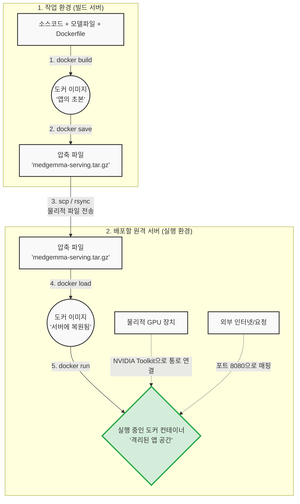

# MedGemma 도커 배포 완벽 이해 가이드

이 문서는 기존 안내 문서(`python/serving/DOCKER_DEPLOYMENT.md`)의 각 명령어들이 **실제로 어떤 의미를 가지며, 내부적으로 어떻게 동작하는지** 도커의 기본 컨셉과 연결하여 쉽게 이해할 수 있도록 작성된 해설서입니다.

---

## 1. 전체 배포 파이프라인 조망

먼저, 우리가 진행할 전체 흐름을 그림으로 이해해 보겠습니다. 도커 허브(Docker Hub) 같은 온라인 저장소를 거치지 않고, **이미지를 직접 파일로 구워서 외부 서버로 배달하는 "오프라인(폐쇄망) 배포 방식"**입니다.



요약하자면: **요리 레시피와 재료(Dockerfile) ➔ 완성된 밀키트(Image) ➔ 배달(tar 파일 전송) ➔ 조리 및 서빙(Container Run)** 의 과정입니다.

---

## 2. 단계별 핵심 원리 및 명령어 해부

### [1단계] 셋업: 왜 NVIDIA Toolkit이 필요할까?

> [!NOTE]
> **핵심 원리: 컨테이너는 원래 GPU를 볼 수 없습니다!**

도커 컨테이너는 기본적으로 호스트 컴퓨터에서 완전히 "격리된 방"입니다. 이 방 안에서는 호스트의 CPU와 RAM은 빌려 쓸 수 있지만, 그래픽카드(NVIDIA GPU) 같은 특수한 하드웨어 장치는 기본적으로 구경조차 할 수 없습니다. 

`python/serving/DOCKER_DEPLOYMENT.md` 가이드의 **NVIDIA Container Toolkit 설치** 부분은 바로 이 격리된 방(컨테이너)에 **GPU와 연결되는 전용 파이프라인(통로)**을 뚫어주는 작업입니다. 이것이 깔려있어야만 컨테이너 안에서 AI 모델이 호스트 서버의 강력한 GPU 자원을 끌어다 쓸 수 있습니다. 

### [2단계] 이미지 빌드 (`docker build`)

이미지를 만드는 것은 코드를 실행하는 것이 아니라, 앞으로 **언제 어디서든 똑같이 실행될 "얼음" 상태를 얼리는 것**입니다.

```bash
# 도커 이미지(얼음)를 생성하는 마법의 명령어
docker build -f python/serving/Dockerfile -t medgemma-serving:latest .
```

* `-f python/serving/Dockerfile`: **"이 레시피를 보고 요리해 줘"** 라는 뜻입니다. 이 파일 안에는 "우분투 OS를 깔고 ➔ 파이썬을 깔고 ➔ Medgemma 코드를 복사하고 ➔ 필수 라이브러리를 설치해라" 라는 설계도가 들어있습니다.
* `-t medgemma-serving:latest`: 만들어질 이미지에 **이름표(태그)**를 붙입니다. `이름:버전` 형식입니다.
* `.` (맨 끝의 점): **"지금 내가 있는 이 폴더의 모든 재료(코드, 모델 파일 등)를 도커에게 넘겨줄게"**라는 뜻입니다. 이것을 '빌드 컨텍스트'라고 부릅니다.

### [3단계] 이미지 추출 및 전송 (`docker save` & `scp`)

도커 이미지를 외부로 보내는 방법은 보통 도커 허브(Docker Hub)에 `push` 하고, 외부 서버에서 `pull`로 당겨받는 것입니다. 하지만 현재 가이드는 이미지를 직접 압축 파일로 만들고 있습니다.

> [!TIP]
> **왜 굳이 직접 파일로 압축할까요?**
> 사내 보안망이나 클라우드 비용 문제, 혹은 수 기가바이트(GB)에 달하는 모델 파일이 포함된 대용량 이미지의 경우, 직접 `tar` 파일로 구워서 복사(`scp` 매뉴얼 전송 등)하는 것이 더 직관적이고 네트워크 환경의 제약을 적게 받기 때문입니다.

```bash
docker save medgemma-serving:latest | gzip > medgemma-serving.tar.gz
```
"이 이름표를 가진 도커 이미지를 꺼내서 ➔ 압축해서 ➔ `.tar.gz` 파일로 내보내 줘" 라는 직관적인 구조입니다. 이제 이 파일을 USB에 담거나, `scp`로 다른 서버에 던져주면 됩니다.

### [4단계] 외부 서버 배포 및 컨테이너 실행 (`docker run` 완벽 분해)

가장 중요한 단계입니다. 전달받은 `tar` 파일을 `docker load`로 다시 이미지로 푼 뒤, 컨테이너로 실행시킵니다. 알고 계신 것처럼 **"이미지를 컨테이너로 올려서 실행"**시키는 과정이며 컨테이너 자체를 수정하지 않고 호스트와 연결하는 다양한 스위치들이 존재합니다.

```bash
docker run -d \
  --name medgemma-server \
  --gpus all \
  -p 8080:8080 \
  --shm-size=16g \
  medgemma-serving:latest
```

이 엄청난 길이의 옵션들이 컨테이너에 물리적으로 어떤 제어를 가하는지 분해해보면 다음과 같습니다:

1. `-d` (Detach): **백그라운드 실행 모드**. 이 명령어를 치고 나면 터미널 창을 끄거나 퇴근해도, 컨테이너는 서버 뒷단에서 계속 뺑뺑이 돌며 서비스를 유지합니다.
2. `--name medgemma-server`: 컨테이너의 이름을 사람이 부르기 쉽게 지어줍니다. 나중에 죽이거나(stop) 살릴 때(start) 이 이름을 부르면 됩니다.
3. `--gpus all`: 앞서 1단계에서 뚫어놓은 **통로를 개방**합니다. "이 컨테이너는 호스트의 모든 GPU에 접근할 권한을 준다"는 뜻입니다. 특정 GPU만 원하면 `"device=0"` 처럼 통계를 제한할 수 있습니다.
4. `-p 8080:8080` (Port): **문과 벽 부수기**. `호스트포트:컨테이너포트` 입니다. 외부에서 이 서버의 `8080` 포트로 접속하면, 완전히 대역이 차단된 컨테이너 내부의 `8080` 빈틈으로 트래픽을 토스해 주라는 뜻입니다. 이 구멍이 없으면 밖에서 서버를 호출(`curl`)할 수 없습니다.
5. `--shm-size=16g`: 공유 메모리(Shared Memory) 크기입니다. AI 모델, 특히 병렬 처리가 많은 경우 도커의 기본 메모리 설정(보통 64MB)으로는 턱없이 부족하여 프로그램이 뻗어버립니다. 이를 16GB로 강제 확장하는 옵션입니다.
6. `medgemma-serving:latest`: **어떤 이미지를 원본으로 할 건지** 지정하는 마지막 목적어입니다.

### [5단계] 동작 테스트 및 모니터링

서버가 실행되었으니(컨테이너가 올라갔으니), 이제 외부에서 찔러보거나 상황을 지켜봅니다.

```bash
# 외부에서 접속해보기 (포트포워딩 -p 8080:8080 의 결과)
curl http://localhost:8080/health
```
이 요청은 `호스트PC ➔ 호스트포트(8080) ➔ 컨테이너포트(8080) ➔ Medgemma API 서버` 순서로 흘러갑니다.

```bash
# 블랙박스(컨테이너) 내부 들여다보기
docker logs -f medgemma-server
```
컨테이너 안에서 실제로 어떤 로그가 찍히는지(AI 모델 추론 결과, 에러 코드 등) 실시간(`-f`, follow)으로 훔쳐보는 창문 역할입니다. 

---

## 3. 실전 문제 해결 (트러블슈팅 원리)

가이드에 명시된 에러들도 이젠 원리가 이해되실 것입니다.

| 에러 메시지 현상 | 구조적 원인 | 해결책 |
| :--- | :--- | :--- |
| **"could not select device driver"** | 컨테이너를 생성하려고 `--gpus` 옵션을 줬는데, 호스트 PC에 NVIDIA Toolkit 통로가 설치되어 있지 않아 도커가 당황함. | 배포 서버에서 NVIDIA Container Toolkit을 설치해야 함. (위에 설명한 1단계 작업 누락) |
| **"Port 8080 already in use"** | 매핑하려는 호스트 PC의 현관문 8080을 이미 다른 프로그램(다른 컨테이너 등)이 사용 중이어서 문을 열 수 없음. | `-p 8081:8080` 처럼 호스트쪽 앞의 숫자만 비어있는 현관문 번호로 교체하면 됨. (컨테이너 내부 8080은 신경 안 써도 됨) |
| **"GPU memory insufficient"** | 컨테이너 실행은 잘 되었지만, 물리적인 호스트 GPU 시스템 자원(VRAM)이 방대한 모델에 비해 턱없이 작거나 누군가 선점중임. | `--gpus '"device=1"'` 처럼 다른 비어 있는 GPU를 지정하거나, 서버의 메모리를 업그레이드해야 함. |
| **"docker build command not found"** | 요리책은 있는데 정작 요리사인 도커 엔진 프로그램 자체가 호스트 서버에 안 깔려 있음. | 우분투 등 OS에 맞춰서 Docker 패키지 도구 설치. |

> [!TIP]
> 알고 계신 대로 도커의 철학은 **"불변성(Immutable)"** 입니다. 서버에 배포한 후 코드를 수정하고 싶다면 컨테이너에 몰래 들어가 코드를 고치는 것이 아니라, 가이드라인의 1단계로 다시 돌아가 코드를 변경하고 **새 이름표를 단 이미지를 다시 구운 뒤 ➔ 전송 ➔ 덮어쓰기 실행** 하는 구조로 유지보수를 진행합니다. (설정 파일 하나만 빼고 싶을 때만 볼륨마운트 `-v` 를 활용합니다).
